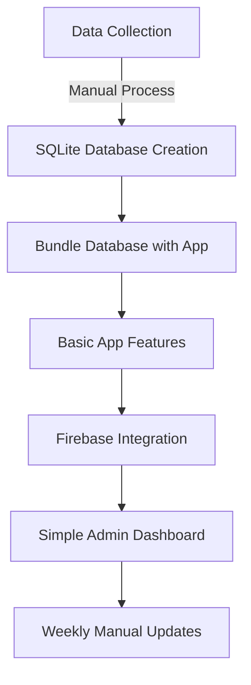
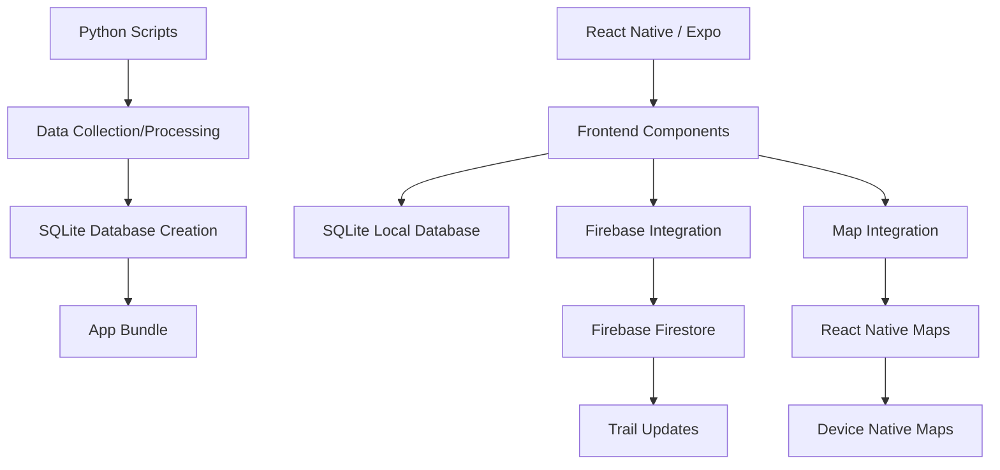
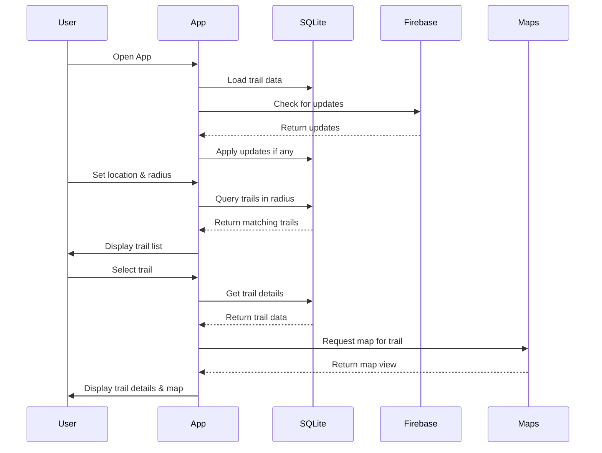

# Philadelphia Hiking Trails App - MVP

A mobile application for discovering hiking trails in Philadelphia and surrounding counties (Bucks, Chester, Delaware, and Montgomery).

## Project Overview

This app helps users find hiking trails in the Philadelphia region with features including:

- Location-based search with radius filtering (1-50 miles)
- Trail information (name, difficulty, length)
- Distance from user's current location
- Map visualization of trails
- Offline functionality for use on the trails

## Free MVP Implementation Plan

This MVP is designed to be completely free to develop while demonstrating core functionality.

### Free Services Used

- **Firebase Free Tier**: Cloud storage and updates
- **Expo**: React Native development framework
- **OpenStreetMap API**: Trail data collection
- **React Native Maps**: Map visualization using device's native maps
- **GitHub Pages**: Simple admin dashboard (if needed)

### Implementation Phases



#### Phase 1: Data Collection & Processing
- Collect trail data from OpenStreetMap and public websites
- Process and validate data using Python scripts
- Create SQLite database to bundle with the app

#### Phase 2: Core App Development
- Implement search functionality with radius filtering
- Create trail listing with essential information
- Develop map view showing trail locations
- Calculate distance from user's location

#### Phase 3: Updates & Maintenance
- Implement simple Firebase integration for trail updates
- Create basic admin interface for data management
- Set up weekly manual update process

### Timeline

| Week | Focus | Free Tools |
|------|-------|------------|
| 1-2 | Data Collection | OpenStreetMap, Python scripts |
| 3-4 | Core App Development | Expo, React Native, SQLite |
| 5 | Firebase Integration | Firebase free tier |
| 6 | Testing & Refinement | Expo Go for distribution |

## Technical Implementation Details

### Technology Stack

- **Frontend**: React Native with Expo
- **Local Storage**: SQLite
- **Cloud Storage**: Firebase Firestore (free tier)
- **Maps**: React Native Maps with Apple/Google Maps
- **Data Processing**: Python with pandas/geopandas

### Architecture Overview



### Data Flow



### Directory Structure

```
PhillyHikingApp/
├── assets/                  # Images, icons, and static assets
├── src/
│   ├── components/          # Reusable UI components
│   │   ├── TrailCard.js     # Trail preview card
│   │   ├── MapView.js       # Map component
│   │   └── SearchFilters.js # Search and filter controls
│   ├── screens/             # App screens
│   │   ├── HomeScreen.js    # Main search screen
│   │   ├── TrailListScreen.js # Results list
│   │   ├── TrailDetailScreen.js # Individual trail view
│   │   └── MapScreen.js     # Full map view
│   ├── services/            # Business logic
│   │   ├── database.js      # SQLite operations
│   │   ├── firebase.js      # Firebase operations
│   │   ├── location.js      # Geolocation services
│   │   └── trailService.js  # Trail data operations
│   ├── utils/               # Helper functions
│   │   ├── distance.js      # Distance calculations
│   │   └── permissions.js   # Permission handling
│   └── App.js               # Main app component
├── data/                    # Data processing scripts
│   ├── collect_trails.py    # Data collection script
│   ├── process_data.py      # Data cleaning script
│   └── create_database.py   # SQLite database creation
└── app.json                 # Expo configuration
```

### Database Schema

```sql
-- Core trail information
CREATE TABLE trails (
    id TEXT PRIMARY KEY,
    name TEXT NOT NULL,
    difficulty TEXT CHECK(difficulty IN ('Easy', 'Moderate', 'Hard')),
    length_miles REAL,
    county TEXT,
    start_lat REAL,
    start_lon REAL,
    status TEXT DEFAULT 'open'
);

-- Trail path coordinates
CREATE TABLE trail_points (
    id INTEGER PRIMARY KEY AUTOINCREMENT,
    trail_id TEXT,
    sequence INTEGER,
    latitude REAL,
    longitude REAL,
    FOREIGN KEY (trail_id) REFERENCES trails(id)
);

-- Metadata for versioning
CREATE TABLE metadata (
    key TEXT PRIMARY KEY,
    value TEXT
);
```

## Setup Instructions

### Prerequisites

- Node.js and npm
- Python 3.x (for data processing)
- Expo CLI
- Firebase account (free tier)

### Development Environment Setup

1. **Install Expo CLI**:
   ```bash
   npm install -g expo-cli
   ```

2. **Create New Project**:
   ```bash
   expo init PhillyHikingApp
   cd PhillyHikingApp
   ```

3. **Install Dependencies**:
   ```bash
   npm install react-native-maps
   npm install @react-native-firebase/app @react-native-firebase/firestore
   npm install react-native-sqlite-storage
   npm install @react-navigation/native @react-navigation/stack
   npm install expo-location
   ```

4. **Firebase Setup**:
   - Create a new Firebase project
   - Enable Firestore database
   - Add the Firebase configuration to your app

5. **Python Environment for Data Processing**:
   ```bash
   python -m venv venv
   source venv/bin/activate  # On Windows: venv\Scripts\activate
   pip install pandas geopandas requests beautifulsoup4 sqlite3
   ```

## Development Workflow

1. **Data Collection & Processing**:
   - Run the Python scripts in the `data/` directory to collect and process trail data
   - This creates the SQLite database that will be bundled with the app

2. **App Development**:
   - Implement the core features using React Native and Expo
   - Test on your device using Expo Go

3. **Firebase Integration**:
   - Set up the Firebase project and configure the app to connect to it
   - Implement the update checking mechanism

4. **Testing**:
   - Use Expo Go to test on your own devices
   - Share with friends and family for feedback
   - Test offline functionality by enabling airplane mode

## Testing Approach

1. **Development Testing**:
   - Use Expo Go app on personal devices
   - Test core functionality in various locations
   - Verify offline functionality

2. **Friends & Family Testing**:
   - Share Expo build via QR code
   - Create simple feedback form
   - Focus testing on specific hiking areas

3. **Distribution for Testing**:
   ```bash
   # Build Expo development build
   expo build:android -t apk  # For Android APK
   # OR
   expo build:ios -t simulator  # For iOS Simulator

   # Share with testers
   expo publish  # Creates QR code others can scan with Expo Go
   ```

## Future Considerations

Once the MVP is validated, consider these enhancements:

1. **App Store Deployment**:
   - Apple Developer account ($99/year)
   - Google Play Developer account ($25 one-time)

2. **Enhanced Features**:
   - User accounts and favorites
   - Trail reviews and ratings
   - Photo uploads
   - Enhanced offline maps
   - Weather integration
   - Trail condition reports

3. **Monetization Options**:
   - Premium features
   - Partnerships with local outdoor retailers
   - Sponsored trails or events

## Potential Challenges

During the development of this hiking app MVP, several challenges may arise that the development team should be prepared to address:

1. **Data Quality & Completeness**:
   - OpenStreetMap data may have inconsistent trail coverage in some areas
   - Trail attributes like difficulty might be missing or inconsistently tagged
   - Some trails might cross county boundaries, creating data continuity issues
   - **Mitigation**: Supplement OSM data with manual research for key trails; implement robust data validation

2. **Offline Functionality**:
   - Balancing app size with comprehensive offline data
   - Managing map tile caching for offline use
   - Ensuring sync mechanisms work reliably when connectivity is restored
   - **Mitigation**: Implement progressive loading of map tiles; prioritize core trail data in the offline bundle

3. **Location Accuracy**:
   - GPS signal can be unreliable in densely wooded or valley areas
   - Battery drain from continuous location tracking
   - **Mitigation**: Implement location smoothing algorithms; add battery-saving location modes

4. **Cross-Platform Consistency**:
   - Ensuring consistent experience between iOS and Android
   - Handling different map rendering capabilities
   - **Mitigation**: Thorough testing on both platforms; implement platform-specific optimizations where needed

5. **Performance Optimization**:
   - SQLite query performance for radius searches with large datasets
   - Rendering efficiency when displaying many trail paths on the map
   - **Mitigation**: Implement spatial indexing; use clustering for map markers; lazy-load trail path data

6. **Free Tier Limitations**:
   - Firebase free tier quotas might be exceeded with growing usage
   - Map API usage limits
   - **Mitigation**: Implement caching strategies; monitor usage metrics closely; be prepared with scaling plan

7. **User Experience in Low/No Connectivity Areas**:
   - Graceful degradation when features can't be accessed
   - Clear user communication about offline limitations
   - **Mitigation**: Design UI with offline-first approach; provide clear visual indicators of offline status

Understanding these challenges upfront will help the development team plan appropriate solutions and set realistic expectations for the MVP release.

## Contributing

We welcome contributions to this project! Please feel free to submit pull requests or open issues for any bugs or feature requests.

## License

[MIT License](LICENSE)
