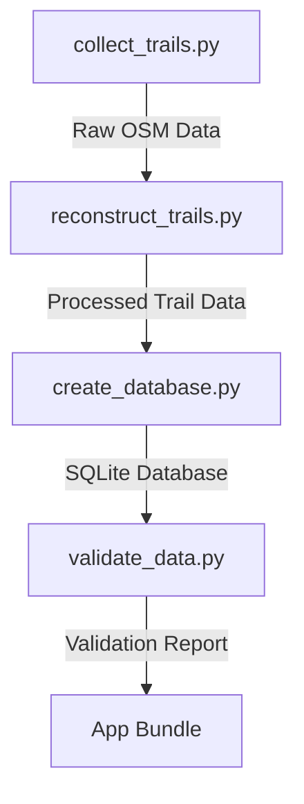

# Philadelphia Hiking Trails App - Data Processing Pipeline

This document provides detailed information about the data processing pipeline for the Philadelphia Hiking Trails app. The pipeline consists of several scripts that collect, process, and validate trail data from OpenStreetMap.

## Pipeline Overview



The data processing pipeline consists of the following steps:

1. **Data Collection**: Collect raw trail data from OpenStreetMap using the Overpass API
2. **Trail Reconstruction**: Reconstruct complete trails from fragmented OSM data using graph-based algorithms
3. **Database Creation**: Create the SQLite database that will be bundled with the app
4. **Data Validation**: Validate the processed data and generate visualizations

## Directory Structure

```
data/
├── collect_trails.py       # Data collection script
├── reconstruct_trails.py   # Trail reconstruction script
├── create_database.py      # Database creation script
├── validate_data.py        # Data validation script
├── utils/                  # Utility functions
│   ├── spatial_utils.py    # Spatial processing utilities
│   ├── graph_utils.py      # Graph processing utilities
│   └── osm_utils.py        # OpenStreetMap utilities
├── raw/                    # Raw data from OpenStreetMap
├── processed/              # Processed trail data
├── logs/                   # Log files
└── visualizations/         # Data visualizations
```

## Script Usage

### 1. Data Collection (`collect_trails.py`)

This script collects raw trail data from OpenStreetMap using the Overpass API.

```bash
# Collect data for all counties
./data/collect_trails.py

# Collect data for a specific county
./data/collect_trails.py --county Philadelphia

# Force recollection even if data already exists
./data/collect_trails.py --county Philadelphia --force
```

#### Output

- `data/raw/{county}_trails_raw.json`: Raw trail data
- `data/raw/{county}_parks_raw.json`: Raw park data
- `data/raw/{county}_poi_raw.json`: Raw POI data
- `data/logs/collection_{timestamp}.log`: Log file

### 2. Trail Reconstruction (`reconstruct_trails.py`)

This script reconstructs complete trails from the fragmented OSM data using graph-based algorithms.

```bash
# Process data for all counties
./data/reconstruct_trails.py

# Process data for a specific county
./data/reconstruct_trails.py --county Philadelphia

# Force reprocessing even if output files already exist
./data/reconstruct_trails.py --county Philadelphia --force
```

#### Output

- `data/processed/{county}_trails.geojson`: Processed trail data in GeoJSON format
- `data/processed/{county}_trails.csv`: Processed trail data in CSV format
- `data/processed/{county}_trail_points.csv`: Trail path coordinates
- `data/logs/reconstruction_{timestamp}.log`: Log file

### 3. Database Creation (`create_database.py`)

This script creates the SQLite database that will be bundled with the app.

```bash
# Create database with data from all counties
./data/create_database.py

# Create database with data from a specific county
./data/create_database.py --county Philadelphia

# Force recreation of the database even if it already exists
./data/create_database.py --county Philadelphia --force
```

#### Output

- `assets/trails.db`: SQLite database
- `data/logs/database_{timestamp}.log`: Log file

### 4. Data Validation (`validate_data.py`)

This script validates the processed data and generates visualizations.

```bash
# Validate data for all counties
./data/validate_data.py

# Validate data for a specific county
./data/validate_data.py --county Philadelphia
```

#### Output

- `data/visualizations/{county}/trails_map.png`: Map of trails
- `data/visualizations/{county}/trail_length_distribution.png`: Trail length distribution
- `data/visualizations/{county}/difficulty_distribution.png`: Difficulty distribution
- `data/visualizations/summary_visualization.png`: Summary visualization
- `data/visualizations/validation_report.json`: Validation report
- `data/logs/validation_{timestamp}.log`: Log file

## Complete Pipeline Execution

To run the complete pipeline for a specific county:

```bash
# Activate the virtual environment
source venv/bin/activate

# 1. Collect data
./data/collect_trails.py --county Philadelphia

# 2. Reconstruct trails
./data/reconstruct_trails.py --county Philadelphia

# 3. Create database
./data/create_database.py --county Philadelphia

# 4. Validate data
./data/validate_data.py --county Philadelphia
```

To run the complete pipeline for all counties:

```bash
# Activate the virtual environment
source venv/bin/activate

# 1. Collect data
./data/collect_trails.py

# 2. Reconstruct trails
./data/reconstruct_trails.py

# 3. Create database
./data/create_database.py

# 4. Validate data
./data/validate_data.py
```

## Data Processing Details

### 1. Data Collection

The data collection script uses the Overpass API to query OpenStreetMap for:

- **Trails**: Paths, footways, tracks, and hiking routes
- **Parks**: Parks, protected areas, and nature reserves
- **POIs**: Viewpoints, peaks, drinking water sources, parking, toilets, guideposts, information points, and picnic tables

The script handles rate limiting, caching, and error recovery to ensure reliable data collection.

### 2. Trail Reconstruction

The trail reconstruction script uses a graph-based approach to reconstruct complete trails from fragmented OSM data:

1. **Graph Construction**: Create a graph where nodes are OSM nodes and edges are trail segments
2. **Connected Components**: Identify connected components in the graph (potential trails)
3. **Path Finding**: Find paths between endpoints to reconstruct complete trails
4. **Attribute Processing**: Combine attributes from multiple OSM elements

This approach handles the challenges of fragmented and inconsistent trail data in OpenStreetMap.

### 3. Database Creation

The database creation script creates a SQLite database with the following schema:

```sql
-- Core trail information
CREATE TABLE trails (
    id TEXT PRIMARY KEY,
    name TEXT NOT NULL,
    difficulty TEXT CHECK(difficulty IN ('Easy', 'Moderate', 'Hard')),
    length_miles REAL,
    county TEXT,
    start_lat REAL,
    start_lon REAL,
    status TEXT DEFAULT 'open'
);

-- Trail path coordinates
CREATE TABLE trail_points (
    id INTEGER PRIMARY KEY AUTOINCREMENT,
    trail_id TEXT,
    sequence INTEGER,
    latitude REAL,
    longitude REAL,
    FOREIGN KEY (trail_id) REFERENCES trails(id)
);

-- App metadata for versioning
CREATE TABLE app_metadata (
    key TEXT PRIMARY KEY,
    value TEXT
);
```

The script also creates spatial indexes for efficient queries.

### 4. Data Validation

The data validation script performs the following checks:

- **Completeness**: Check for missing attributes
- **Consistency**: Verify that trail points match trails
- **Quality**: Analyze trail length and difficulty distribution

The script also generates visualizations to help verify the data quality.

## Troubleshooting

### Common Issues

1. **Missing Data**

   If the data collection script fails to collect data for a county, check:
   - Internet connection
   - Overpass API status
   - County name spelling

   Solution: Try running the script with the `--force` flag.

2. **Empty Trail Data**

   If the trail reconstruction script produces empty output, check:
   - Raw data files
   - Overpass query in `collect_trails.py`

   Solution: Modify the Overpass query to include more trail types.

3. **Database Creation Errors**

   If the database creation script fails, check:
   - Processed data files
   - File permissions

   Solution: Check the log file for specific errors.

4. **Visualization Errors**

   If the data validation script fails to generate visualizations, check:
   - Matplotlib installation
   - File permissions

   Solution: Install required dependencies with `pip install matplotlib`.

### Log Files

All scripts generate detailed log files in the `data/logs/` directory. Check these logs for error messages and debugging information.

## Dependencies

The data processing pipeline requires the following Python packages:

- `pandas`: Data manipulation
- `geopandas`: Spatial data manipulation
- `shapely`: Geometric operations
- `networkx`: Graph algorithms
- `matplotlib`: Data visualization
- `requests`: HTTP requests
- `overpass`: Overpass API client

Install these dependencies with:

```bash
pip install -r data/requirements.txt
```

## Performance Considerations

- **Data Collection**: The Overpass API has rate limits, so data collection may take some time.
- **Trail Reconstruction**: The graph-based algorithms can be memory-intensive for large datasets.
- **Database Creation**: Importing large datasets into SQLite can be slow.
- **Data Validation**: Generating visualizations for large datasets can be memory-intensive.

For large datasets, consider processing one county at a time.
